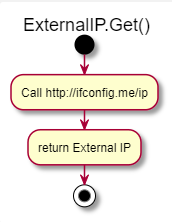

<!--Category:C#--> 
 <p align="right">
        <a href="https://www.nuget.org/packages/ProductivityTools.NetworkUtilities/"></a>
        <a href="http://productivitytools.tech/NetworkUtilities/"><a> 
        <a href="https://github.com/pwujczyk/ProducvitityTools.NetworkUtilities"></a>
</p>
<p align="center">
    <a href="http://productivitytools.tech/">
        
    </a>
</p>


# Network Utilities

The library returns external IP of the computer.
<!--more-->

Currently library has one method, which returns external IP, to do it it calls http://ifconfig.me/ip which shows ip of the caller. 

```c#
var externalIp = ExternalIP.Get();
```
<!--og-image-->

